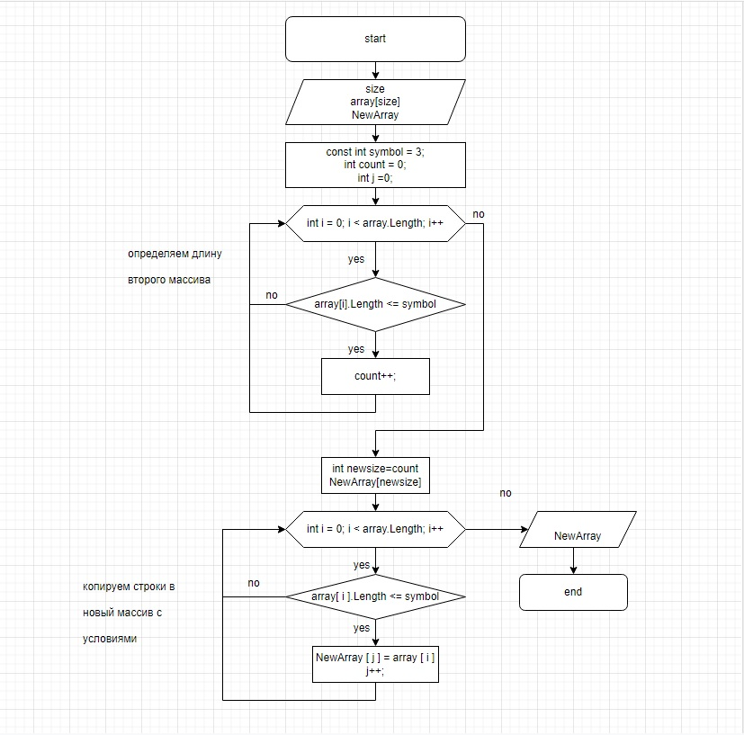

# Итоговая проверочная работа.
## Задача
    Написать программу, которая из имеющегося массива строк формирует массив из строк, длина которых меньше либо равна трём символам. Первоначальный массив можно ввести с клавиатуры, либо задать на старте выполнения алгоритма. При решении не рекомендуется пользоваться коллекциями, лучше обойтись исключительно массивами.
### Алгоритм программы

+	Объявляем два массива: изначальный и конечный.
+   Создаем  константу для соблюдения условия: "формирует массив из строк, длина которых меньше либо равна трём символам."
+	Создаём метод с циклом for, который считает количество строк, длина которых меньше либо равна 3 символа, для определения длины второго массива.
+   Создаём второй метод с циклом for,который добавляет строки, длина которых меньше либо равна 3 символа, в новый массив.
+	По завершени цикла выводим новый массив с результатом в консоль.

### Примеры массивов и результаты выводов

>["hello", "2", "world", ":-)"] -> ["2", ":-)"]

>["1234", "1567", "-2", "computer science"] -> ["-2"]

>["Russia", "Denmark", "Kazan"] -> []

 

